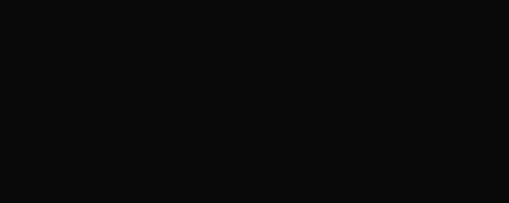

# ZPE-Image

## What This Is

Deterministic sparse-stroke image encoder. Geometry-layer encoding for glyphs, flow graphs, mazes, and structural skeletons; natural-image coverage stays out of scope.

Two routes ship: a primary sparse-stroke route and a narrower hole-bearing bundle route for exactly three hole-bearing forms. Both are CI-falsified.

**Strongest intrinsic result (CI-anchored, no external baseline):** 5.75× byte reduction on the five accepted sparse figures versus the internal quadtree-enhanced fallback, with 100% accept and reject rates and perturbation floors clearing documented thresholds.

## Codec Mechanics

<p>
  
</p>

| Field | Value |
| ------- | ------- |
| Architecture | IMAGE_STREAM |
| Encoding | IMAGE_SPARSE_GEOMETRY_V1 |
| Mechanics Asset | `.github/assets/readme/lane-mechanics/IMAGE.gif` |

## Key Metrics

| Metric | Value | Baseline |
| -------- | ------- | ---------- |
| SPARSE_ACCEPTS | 5/5 | bounded pack |
| REJECT_RATE | 100% | 7 retained negatives |
| SPARSE_WORST_PERTURB_IOU | 0.632 | floor threshold ≥0.62 |
| SPARSE_WORST_PERTURB_SKELETON_F1 | 0.741 | floor threshold ≥0.74 |

> Source: `proofs/artifacts/fresh_falsification_packet.json`, `validation/results/fresh_falsification_check.json`

## Repo Identity

| Field | Value |
| ------- | ------- |
| Identifier | ZPE-Image |
| Repository | https://github.com/Zer0pa/ZPE-Image |
| Section | encoding |
| Visibility | PUBLIC |
| Architecture | IMAGE_STREAM |
| Encoding | IMAGE_SPARSE_GEOMETRY_V1 |
| Commit SHA | c1ed7abaa560 |
| License | SAL-7.0 |
| Authority Source | proofs/artifacts/fresh_falsification_packet.json |

## Readiness

| Field | Value |
| ------- | ------- |
| Verdict | STAGED |
| Checks | 6/6 |
| Anchors | 3 display anchors |
| Commit | c1ed7abaa560 |
| Authority | proofs/artifacts/fresh_falsification_packet.json |

### Honest Blocker

We do not claim photo, texture, gradient, or broad natural-image coverage.; We do not claim that the narrower hole-bearing route covers the full sparse set.; We do not claim that bounded acceptance on this pack equals general image coverage.

## What We Prove

- The primary sparse-stroke route accepts `glyph_a`, `fork_tree`, `loop_spine`, `maze_turns`, and `serpentine`, and rejects all 7 retained mixed and natural-image negatives on the same verification pack.
- Under four perturbation types (dilate_1, salt_pepper_1pct, shift_x1, shift_y1) the worst-case reconstruction IoU is 0.632 and worst-case skeleton F1 is 0.741, both clearing their documented thresholds (0.62 and 0.74 respectively).
- On accepted sparse figures the geometry-sparse-stroke encoder uses a mean of 1,362 bytes (20-bit packed) versus 7,839 bytes for the quadtree-enhanced fallback — a 5.75× byte reduction within this bounded scope.
- The narrower hole-bearing bundle route accepts exactly `glyph_a`, `loop_spine`, and `maze_turns`; `fork_tree` and `serpentine` are correctly outside that subset. Bundle projection IoU = 1.0 and skeleton F1 = 1.0 under all perturbations for all three accepted cases.

## What We Don't Claim

- No photo, texture, gradient, or broad natural-image coverage.
- The hole-bearing route does not cover the full sparse set.
- Bounded acceptance on this pack does not equal general image coverage.
- No external codec comparison (JPEG/WebP/AVIF/JPEG-XL) — baselines are internal only.

## Verification Status

| Code | Check | Verdict |
| ------ | ------- | --------- |
| V_01 | Primary sparse route accepts the five bounded sparse figures. | PASS |
| V_02 | Primary sparse route rejects the mixed and natural-image buckets. | PASS |
| V_03 | Sparse perturbation floors stay above documented thresholds (IoU ≥0.62, skeleton F1 ≥0.74). | PASS |
| V_04 | Secondary hole-bearing route accepts exactly 3/5 positives; rejects out-of-scope positives. | PASS |
| V_05 | Installed package imports and runs without sibling runtime dependencies. | PASS |
| V_06 | Root repo surface ships with Zer0pa Source-Available License v7.1. | PASS |

## Proof Anchors

| Path | State |
| ------ | ------- |
| `proofs/manifests/CURRENT_VERIFICATION_PACKET.md` | VERIFIED |
| `proofs/artifacts/fresh_falsification_packet.json` | VERIFIED |
| `validation/results/fresh_falsification_check.json` | VERIFIED |

## Repo Shape

| Field | Value |
| ------- | ------- |
| Proof Anchors | 3 display anchors |
| Modality Lanes | 1 |
| Architecture | IMAGE_STREAM |
| Encoding | IMAGE_SPARSE_GEOMETRY_V1 |
| Verification | 6/6 checks |
| Authority Source | proofs/artifacts/fresh_falsification_packet.json |

## Extended Metrics

Rows retained from the previous expanded `## Key Metrics` table. The public product page uses the first four rows only.

| Metric | Value | Baseline | Notes |
|---|---:|---|---|
| SPARSE_MEAN_BYTES | 1,362 | 7,839 quadtree baseline | 5.75× byte reduction on accepted figures |
| BUNDLE_ACCEPTS | 3/3 | hole-bearing subset | projection IoU = 1.0 under all perturbations |
| BUNDLE_MEAN_BYTES | 3,655 | 8,459 quadtree baseline | 2.31× byte reduction on bundle route |

## Quick Start

```bash
python3 -m venv .venv
. .venv/bin/activate
python3 -m pip install --upgrade pip
python3 -m pip install '.[dev]'
zpe-image-verify --output validation/results/fresh_falsification_check.local.json
pytest -q
```

## Upcoming Workstreams

This section captures the active lane priorities — what the next agent or contributor picks up, and what investors should expect. Cadence is continuous, not milestoned.

- **External comparator integration** — Active Engineering. Add gzipped-SVG and PNG-of-render-at-fixed-quality comparators to the proof artifact; report both, let reviewer pick. Removes the no-market-reference-frame gap on the current 5.75× CR claim (currently measured only against an internal quadtree fallback).
