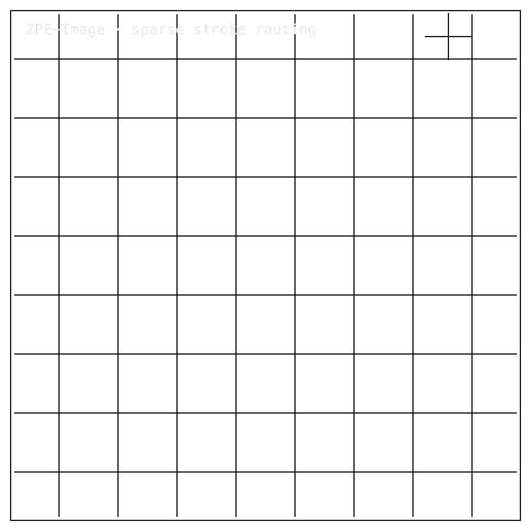

# ZPE-Image

## Install / Developer Commands

#### Quick Start

```bash
python3 -m venv .venv
. .venv/bin/activate
python3 -m pip install --upgrade pip
python3 -m pip install '.[dev]'
zpe-image-verify --output validation/results/fresh_falsification_check.local.json
pytest -q
```

<table width="100%">
<tr>
<td width="100%" valign="top">
<div><span><b>00 · ZPE-IMAGE</b> · STRUCTURAL CODEC</span> <span>RESEARCH-READY · EXTERNAL COMPARATORS OPEN</span></div>
      <h1>Store the shape, <span>not the screenshot.</span></h1>
      <p>Sparse-stroke encoder · ZPE-Image · <em>zpe-image</em> 0.1.0 stale · github.com/Zer0pa/ZPE-Image</p>
      <p>Most image codecs sell one number: bytes saved on photographs. ZPE-Image sells two. On five sparse structural figures — glyphs, mazes, flow-graphs, skeletons — it delivers <strong>5.75× byte reduction</strong> against the internal baseline. On seven natural and mixed inputs, it returns a <strong>refusal</strong> at encode time. The codec is built to answer two questions in one packet: what it stores, and what it will never accept. Photographs are not in scope, and that is the point.</p>
</td>
</tr>
</table>

<table width="100%">
<tr>
<td width="100%" valign="top">
<figure>
        <div></div>
        <figcaption><b>Scope:</b> sparse structural figures. Accepted shapes encode; photographs and mixed inputs refuse at the boundary.</figcaption>
      </figure>
</td>
</tr>
</table>

<table width="100%">
<tr>
<td width="100%" valign="top">
<div><b>01 · THE GAP</b> <span>ENCODED OR REFUSED</span></div>
      <h2>No compact codec addresses sparse structural strokes while explicitly refusing everything else.</h2>
</td>
</tr>
</table>

<table width="100%">
<tr>
<td width="100%" valign="top">
<div><b>02 · MARKETS</b> <span>ADJACENT FORECASTS</span></div>
      <div>
        <div>
          <div><span>Technical illustration / CAD</span>  <span>'30 · $12.8B</span></div>
          <div><span>Diagramming software</span>  <span>'30 · $1.9B</span></div>
          <div><span>Document archival</span>  <span>'30 · $7.3B</span></div>
          <div><span>Vector graphics tools</span>  <span>'30 · $4.1B</span></div>
          <div><span>Graphic design</span>  <span>'31 · $85.5B</span></div>
        </div>
      </div>
      <div>Every technical drawing held in a corporate archive touches these markets; ZPE-Image addresses the sparse-stroke slice that compresses without taking in photographs.</div>
</td>
</tr>
</table>

<table width="100%">
<tr>
<td width="50%" valign="top">
<div><b>03 · VALUE</b></div>
      <div>$1.9<span>B</span></div>
      <div>2030 diagramming software; ZPE-Image is the sparse-stroke archive slice inside that category.</div>
</td>
<td width="50%" valign="top">
<div><b>04 · INSIGHT</b></div>
      <h2>Structural drawings need <span>a bounded archive.</span></h2>
</td>
</tr>
</table>

<table width="100%">
<tr>
<td width="50%" valign="top">
<div><b>05.1 · CURRENT TECH</b> <span>COMPRESS EVERYTHING</span></div>
        <p>JPEG, WebP, AVIF, and JPEG-XL compress photographs. SVG describes vectors. None of them ask whether the input is the right kind of image. A maze, a glyph, a skeleton sits inside formats built for something else.</p>
</td>
<td width="50%" valign="top">
<div><b>05.2 · OUR TECH</b> <span>KNOW THE BOUNDARY</span></div>
        <p>ZPE-Image encodes structural figures where the line itself carries meaning. It names its accepted scope — <strong>5 of 5 sparse figures</strong> — and its categorical refusals — <strong>7 of 7 natural and mixed inputs</strong> — inside the same packet. On accepted figures, bytes drop by <strong>5.75&times;</strong> against the internal baseline. On the rest, the codec returns nothing.</p>
</td>
</tr>
</table>

<table width="100%">
<tr>
<td width="100%" valign="top">
<div><b>05.3 · BENCHMARKS</b> <span>ACCEPT / REJECT PACK</span></div>
      <div>
        <div>
          <div><span>Bytes</span><b>5.75</b><small>&times; vs quadtree</small></div>
          <div><span>Accept</span><b>5/5</b><small>sparse figures</small></div>
          <div><span>Reject</span><b>7/7</b><small>natural negatives</small></div>
          <div><span>Floors</span><b>0.632</b><small>IoU · F1 0.741</small></div>
        </div>
        <div>
          <div><span>5/5 accept</span>  <span>PASS</span></div>
          <div><span>7/7 reject</span>  <span>PASS</span></div>
          <div><span>comparators</span>  <span>OPEN</span></div>
        </div>
      </div>
      <div><b>Scope:</b> internal baseline only. JPEG, WebP, AVIF, and JPEG-XL comparator runs are open.</div>
</td>
</tr>
</table>

<table width="100%">
<tr>
<td width="34%" valign="top">
<div><b>06 · MEASUREMENT</b> <span>ACCEPT/REJECT PACKET</span></div>
      <h2>Every measurement names what the codec accepted — <span>and what it refused.</span></h2>
</td>
<td width="66%" valign="top">
<div><b>06.1 · COMPARATIVE PERFORMANCE</b> <span>INTERNAL BASELINE BYTES</span></div>
      <div>
        <div>
          <div><span>ZPE-Image</span>  <span>5.75&times; smaller</span></div>
          <div><span>Internal quadtree</span>  <span>1.00&times; baseline</span></div>
          <div><span>JPEG/WebP/AVIF</span>  <span>no comparator</span></div>
          <div><span>JPEG-XL</span>  <span>not closed</span></div>
        </div>
      </div>
      <div>Five sparse figures accepted, seven natural and mixed inputs refused. Perturbation floors: IoU 0.632, skeleton F1 0.741 under four perturbation types. Artifact dated 2026-04-21. External comparators against JPEG, WebP, AVIF, JPEG-XL not yet closed.</div>
</td>
</tr>
</table>

<table width="100%">
<tr>
<td width="100%" valign="top">
<div><b>07 · KEY METRICS</b> <span>MEASURED RESULTS</span></div>
</td>
</tr>
</table>

<table width="100%">
<tr>
<td width="100%" valign="top">
<div><b>07.1 · INTERNAL BYTES</b></div>
      <div>5.75<span>&times;</span></div>
      <div>vs internal baseline · <b>five accepted sparse figures</b></div>
</td>
</tr>
</table>

<table width="100%">
<tr>
<td width="100%" valign="top">
<div><b>07.2 · ACCEPTED</b></div>
      <div>5<span>/5</span></div>
      <div>sparse figures accepted · <b>internal sparse pack</b></div>
</td>
</tr>
</table>

<table width="100%">
<tr>
<td width="100%" valign="top">
<div><b>07.3 · REJECTED</b></div>
      <div>7<span>/7</span></div>
      <div>natural and mixed inputs refused · <b>at encode time</b></div>
</td>
</tr>
</table>

<table width="100%">
<tr>
<td width="100%" valign="top">
<div><b>07.4 · PERTURBATION FLOOR</b></div>
      <div>0.632</div>
      <div>IoU 0.632 · skeleton F1 0.741 · <b>four perturbation types</b></div>
</td>
</tr>
</table>

<table width="100%">
<tr>
<td width="100%" valign="top">
<div><b>07.5 · PROOF PACKET</b></div>
      <div>04-21</div>
      <div>2026-04-21 · <b>PyPI zpe-image 0.1.0 stale</b></div>
</td>
</tr>
</table>

<table width="100%">
<tr>
<td width="100%" valign="top">
<div><b>08 · SCOPE ENFORCEMENT</b> <span>ACCEPTED STRUCTURE ONLY</span></div>
      <h2>The archive stays useful because <span>the boundary is enforced.</span></h2>
</td>
</tr>
</table>

<table width="100%">
<tr>
<td width="66%" valign="top">
<div><b>08.1 · WHAT THE BOUNDARY MEANS</b> <span>ACCEPT / REJECT</span></div>
      <p>On five accepted sparse figures, the dated artifact reports <strong>5.75&times; byte reduction</strong> against the internal quadtree fallback. Seven natural or mixed inputs are refused at encode time, so photographs and wrong inputs never enter the structural archive in the first place. Under four perturbation types — dilate, salt-and-pepper, x-shift, y-shift — the accepted figures hold an <strong>IoU floor of 0.632</strong> and a <strong>skeleton F1 floor of 0.741</strong>. The structural identity of a stored drawing survives a degraded source.</p>
</td>
<td width="34%" valign="top">
<div><b>08.2 · HONEST BLOCKER</b></div>
      <span>Honest Blocker ·</span>
      <p>Natural-image coverage is <strong>out of scope by design</strong>, not a gap. External comparator closure against JPEG, WebP, AVIF, JPEG-XL, gzip, SVG, and PNG is open. The five-figure corpus has not been expanded. PyPI <em>zpe-image 0.1.0</em> is stale, with a corrected release pending.</p>
</td>
</tr>
</table>

<table width="100%">
<tr>
<td width="33%" valign="top">
<div><b>09</b> </div>
      <h2>A CODEC THAT <span>KNOWS WHAT IT REFUSES.</span></h2>
</td>
<td width="67%" valign="top">
<div><b>09.1 · THE AMBITION</b> <span>A BOUNDARY THAT HOLDS</span></div>
      <p>The aim is a structural archive for the world's technical drawings — engineering diagrams, glyphs, schematic flows, hand-drawn proofs — that compresses where line structure carries the meaning, supports retrieval by shape, and physically refuses to swallow photographs that would corrupt the corpus and the compression claim along with it.</p>
</td>
</tr>
</table>

<table width="100%">
<tr>
<td width="33%" valign="top">
<div><b>09.2 · WHAT WORKS NOW</b></div>
        <h2>Working today: 5.75× byte reduction on five accepted sparse figures, 7 of 7 photograph refusals, perturbation floors held.</h2>
</td>
<td width="67%" valign="top">
<div><b>09.3 · WHAT'S STILL OPEN</b></div>
        <h2>Open: external comparator closure against JPEG, WebP, AVIF and JPEG-XL; a current PyPI release; corpus expansion.</h2>
</td>
</tr>
</table>

<table width="100%">
<tr>
<td width="100%" valign="top">
<div><b>09.4</b> &middot; ARCHIVES · NEAR-TERM (12–24 MO)</div>
      <div>Engineering archives hold more drawings</div><div>A technical-illustration archive on a fixed storage budget can keep roughly six times more sparse figures online. The procurement question stops being &ldquo;what do we delete this quarter&rdquo; and becomes &ldquo;what else can we keep accessible.&rdquo;</div>
</td>
</tr>
</table>

<table width="100%">
<tr>
<td width="100%" valign="top">
<div><b>09.5</b> &middot; PROCUREMENT · NEAR-TERM (12–24 MO)</div>
      <div>Buyers can pick a codec that refuses</div><div>A procurement team choosing a structural archive codec can specify behavior on out-of-scope inputs. A codec that rejects a photograph at encode time is a different purchase than one that silently produces garbage, and the contract can say so.</div>
</td>
</tr>
</table>

<table width="100%">
<tr>
<td width="100%" valign="top">
<div><b>09.6</b> &middot; STANDARDS · MID-TERM (24–48 MO)</div>
      <div>Drawing standards gain a refusal contract</div><div>Engineering-drawing and digital-humanities standards bodies can adopt scope-refusal as a spec property, not a warning in documentation. The format itself enforces what it does not encode, so downstream pipelines stop inheriting silent degradation as a category of bug.</div>
</td>
</tr>
</table>

<table width="100%">
<tr>
<td width="100%" valign="top">
<div><b>09.7</b> &middot; SEARCH · MID-TERM (24–48 MO)</div>
      <div>Drawing archives become searchable by shape</div><div>When the same structural figure encodes to the same compact packet, searching a glyph or schematic archive by skeleton topology stops being a brute pixel-similarity problem. Researchers and engineers find drawings the way they think about them — by structure.</div>
</td>
</tr>
</table>

<table width="100%">
<tr>
<td width="100%" valign="top">
<div><b>09.8</b> &middot; IDENTITY · PARADIGM (48 MO+)</div>
      <div>A drawing has a name, not just a file</div><div>Once a structural figure resolves to the same packet across draftspeople and tools, a drawing acquires an identity independent of its file. Citation, provenance, and version chains for technical drawings become first-class, the way they already are for text and code.</div>
</td>
</tr>
</table>
